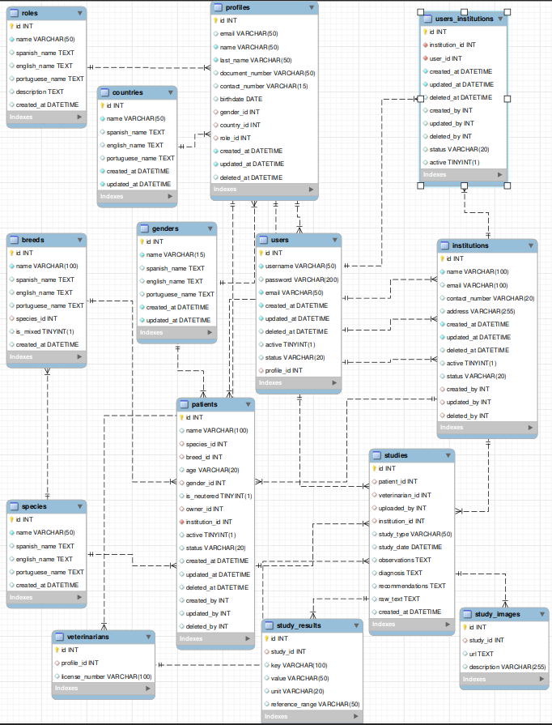
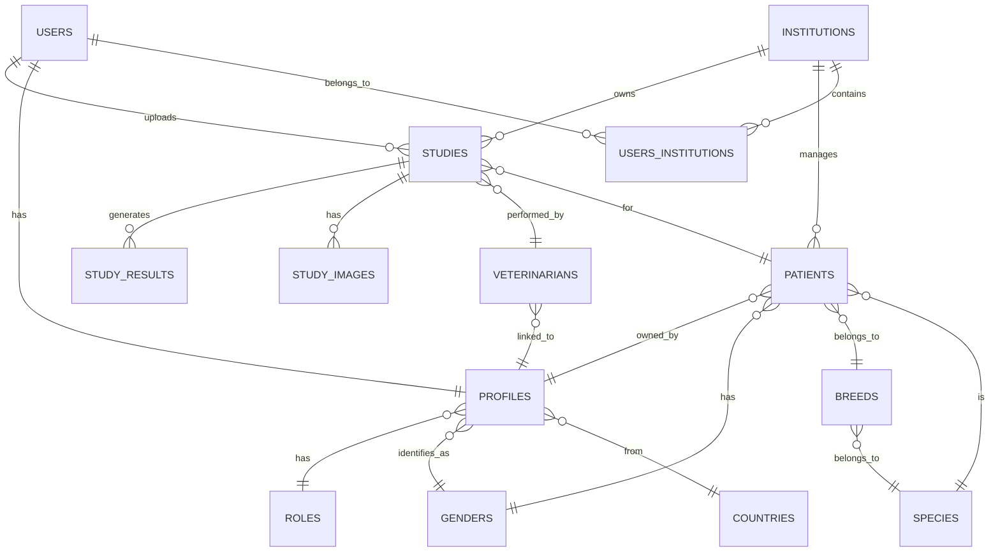

# 🐾 Diagnosis Vet Management System

The Diagnosis Vet Management System is a full-stack application designed to process and manage veterinary study reports 
in a structured and user-friendly way.

The system allows users to upload veterinary reports (PDF format), automatically extract key medical information using 
AI, normalize the data, and store it in a relational database for easy visualization and navigation.

---

## 🚀 What this project does

- 📄 Upload one or multiple veterinary study reports (PDF)
- 🤖 Extract structured information using AI:
  - patient data
  - owner information
  - veterinarian details
  - observations, diagnosis, recommendations
  - lab results and images
- 🧠 Normalize extracted data to ensure consistency (species, breed, gender, etc.)
- 💾 Persist all data in a relational database
- 📊 Provide a simple UI to explore studies, patients, and results

---

## 🧱 Tech Stack

- Backend: FastAPI
- ORM: Peewee
- Database: MySQL
- Frontend: Streamlit
- AI Processing: OpenAI API (LLM-based extraction)
- Containerization: Docker

---

## 🧠 Architecture Overview

The system follows a pipeline-based approach:

```
PDF Upload → Text & Image Extraction → AI Processing → Data Normalization → Database Storage → UI Visualization
```

- Extraction Layer: Parses PDF text and images
- AI Layer: Converts unstructured text into structured JSON
- Normalization Layer: Maps data to canonical entities (species, breeds, etc.)
- Persistence Layer: Stores data in a normalized relational schema
- Presentation Layer: Displays information via Streamlit

--- 

## 🎯 Key Features

- Modular and scalable backend design
- AI-powered document processing
- Robust error handling and retry mechanisms
- Normalized database schema for medical data
- Multi-entity relationships (patients, studies, institutions, users)
- Simple and intuitive user interface

---

## 🗃️ Database Model (ERD)

This database is designed to support a veterinary system that extracts structured data from PDF medical reports using 
AI and stores it in a normalized relational model.





### 📦 Core Tables
### 🐾 Patients

Stores animal information such as species, breed, gender, and owner.

### 👤 Profiles

Represents people (owners, veterinarians, admins). Shared across the system.

### 👥 Users

Authentication layer linked to a profile.

### 🏥 Institutions

Veterinary clinics or organizations managing patients and studies.

### 🧬 Classification Tables
### 🌍 Countries

List of supported countries (multilingual).

### ⚧ Genders

Standardized gender definitions.

### 🐶 Species

Animal types (dog, cat, etc.).

### 🐕 Breeds

Linked to species. Includes normalization support (is_mixed).

### 🎭 Roles

Defines professional roles (veterinarian, owner, admin).

### 📄 Medical Data
### 📑 Studies

Represents a veterinary report (uploaded PDF processed by AI).

Includes:

- observations
- diagnosis
- recommendations
- raw extracted text

### 🧪 Study_Results

Structured lab values extracted from reports.

### 🖼 Study_Images

Images extracted from PDFs and linked to studies.

### 👨‍⚕️ Veterinarians

Links a professional profile with license information.

## 🚀 Backend API Endpoints


### 🧑‍💼 User Endpoints
| Method | Endpoint | Description |
|--------|-----------|-------------|
| `POST` | `/users/` | Create a user tied to an institution |
| `POST` | `/login/` | Authenticate a user |
| `GET` | `/healthcheck/` | Check API health status |
| `GET` | `/version/` | Retrieve system version |

---

### 🐾️ Patients Endpoints
| Method   | Endpoint                   | Description                                     |
|----------|----------------------------|-------------------------------------------------|
| `POST`   | `/patient/`                | Create a patient                                |
| `GET`    | `/patient/{id}`            | Get patient by ID                               |
| `GET`    | `/patient/`                | Get all patient                                 |
| `POST`   | `/patient/upload_patient/` | Upload PDFs studys for a given institution |

---

### 👤 Profile Endpoints
| Method | Endpoint     | Description           |
|--------|--------------|-----------------------|
| `GET`  | `/profiles/` | Retrieve user profile |

---

### 🧭 Role Endpoints
| Method | Endpoint  | Description                |
|--------|-----------|----------------------------|
| `GET`  | `/roles/` | Get all roles |

---

### 🏫 Institution Endpoints
| Method | Endpoint            | Description                    |
|--------|---------------------|--------------------------------|
| `PUT`  | `/institution/{id}` | Update institution information |
| `GET`  | `/institution/all`  | Get all institutions           |
| `GET`  | `/institution/`     | Get institutions by user       |
| `POST` | `/institution/`     | Create institution             |

---

### 🚻 Gender Endpoints
| Method | Endpoint    | Description     |
|--------|-------------|-----------------|
| `GET`  | `/genders/` | Get gender list |

---

### 🌎 Country Endpoints
| Method | Endpoint      | Description           |
|--------|---------------|-----------------------|
| `GET`  | `/countries/` | Get list of countries |

---

### 🐕 Breed Endpoints
| Method | Endpoint  | Description        |
|--------|-----------|--------------------|
| `GET`  | `/breed/` | Get list of breeds |

---

### 🐶 Specie Endpoints
| Method | Endpoint   | Description         |
|--------|------------|---------------------|
| `GET`  | `/specie/` | Get list of species |

---

### 🐶 Study Endpoints
| Method | Endpoint         | Description                                               |
|--------|------------------|-----------------------------------------------------------|
| `GET`  | `/study/`        | Get list of study for a patient for the given institution |
| `GET`  | `/study/result/` | Get list of study result by ID for the given institution  |

---

## 🧱 Project Structure

 ```
 api/
├── app/
│   ├── models/                 # Database models (Peewee ORM)
│   ├── routers/                # FastAPI route definitions
│   ├── services/               # Business logic separated from routes
│   ├── schemas/                # Pydantic models for request/response validation
│   ├── utils/                  # Reusable utilities and helpers
│   ├── resources/
│   │  ├── postman_collection.json   # Example API collection
│   │  ├── database.sql              # MySQL schema
│   │  ├── erd_block.png             # ER diagram image
│   │  └── model.mwb                 # ERD for Workbench
│   ├── __init__,py             # Logging set up
│   └── main.py                 # Uvicorn entry point
frontend/
│   ├── css/                    # CSS files
│   ├── pages/                  # Pages
│   ├── resources/
│   │   └── logo.png            # Image 
│   ├── requirements.txt        # Required libraries for the frontend
│   ├── Dockerfile              # Frontend Dockerfile
│   ├── app.py                  # SteamLit entry point
│   └── utils.py                # General functions
│
.env                          # Backend environment variables
requirements.txt              # Required libraries for the backend
wait-for-it.sh                # Wait for DB before API start
start.sh                      # Launch FastAPI app
Dockerfile                    # Backend Dockerfile
docker-compose.yml
 ```

## 🛠️ Application Behavior

- The database is **automatically initialized** on startup if it doesn’t exist.
- A **seed script** loads essential data (countries, genders, roles, species, breeds).
- Logging is colorized for clearer debugging and log analysis.
- Middleware handles:
  - Automatic **database reconnection**
  - **Language localization**
- **decorator** 
  - available to apply pagination on list endpoints.
  - check institution authorization for endpoint request, if a patient/study does not belong to the institution
  is rejected.
- authentication using **JWT**

---

## 🐳 Docker Setup

The project is fully containerized with **Docker**.

### Build and Run

Before docker execution it must create a `.env` file at the same folder level of **/api/** and 
**/frontend/** with the following content:

```
# RUN_ENV=prod
RUN_ENV=dev
PYTHONPATH=/app

# Base de datos
MYSQL_ROOT_PASSWORD=admin
DB_NAME=db_td
DB_USER=test
DB_PASS=test01
DB_HOST=database
DB_PORT=3306

# API
ACCESS_TOKEN_EXPIRE_MINUTES=1440
SECRET_KEY=bbIzZDc1ZTk2OGYyNmYzYmUzNDQzNTAfZWZlZmQ7NjFlMjJkNWUxNzNmZWE5NTY0NmEzNjU5ZTY3M2ViYjk3Yg==
DEPLOYMENT_SERVICE=local
#DEPLOYMENT_SERVICE=cloud

# Logs
FORMATTER=TXT
# LOG_FILE=/logs/app.log

CORS_ORIGINS=*

UPLOAD_DIR=./api/app/resources/uploads

API_BASE=http://api:8000
WAKE_UP_RETRIES=10
WAKE_UP_DELAY=6
WAKE_UP_TIMEOUT=8

```

Now the docker is ready to be launched.

```
docker-compose up --build
```

### Environment variable explanation

| Variable                         | Description                                                                                                                                                                                                                                                  |
|----------------------------------|--------------------------------------------------------------------------------------------------------------------------------------------------------------------------------------------------------------------------------------------------------------|
| **RUN_ENV**                      | Indicates the current execution environment of the application. Common values are `dev` (development), `prod` (production), or `test`. It allows conditional logic such as using mock data, enabling debug logs, or stricter validation rules in production. |
| **PYTHONPATH**                   | Tells Python where to look for modules and packages. Setting it to `/app` ensures that when the application runs inside a Docker container, Python can correctly import internal modules (like `models`, `routers`, `services`, etc.).                       |
| **MYSQL_ROOT_PASSWORD**          | Root password for the MySQL database instance (used by the database service inside Docker).                                                                                                                                                                  |
| **DB_NAME**                      | Name of the main database schema used by the application. To this name the RUN_ENV varaible will be added as the complete name (in this case, `db_ti_dev`).                                                                                                  |
| **DB_USER**                      | MySQL username the app will use to connect to the database.                                                                                                                                                                                                  |
| **DB_PASS**                      | Password for the above MySQL user.                                                                                                                                                                                                                           |
| **DB_HOST**                      | Hostname of the database server. Inside Docker Compose, `database` refers to the MySQL service container.                                                                                                                                                    |
| **DB_PORT**                      | TCP port where MySQL listens. Default for MySQL is `3306`.                                                                                                                                                                                                   |
| **ACCESS_TOKEN_EXPIRE_MINUTES**  | Duration (in minutes) for which an access token remains valid. `1440` = 24 hours. Used for short-lived authentication tokens (JWT).                                                                                                                          |
| **SECRET_KEY**                   | Cryptographic key used to sign and verify access tokens (JWTs). Should be long, random, and kept secret.                                                                                                                                                     |
| **DEPLOYMENT_SERVICE**           | Indicates where the app is deployed: `local` for Docker/local machine or `cloud` for production deployments (e.g., Render).                                                                                                                                  |
| **FORMATTER**                    | Defines the log output format. Can be `TXT` (plain text, colorized) or `JSON` (structured logs suitable for cloud monitoring systems). The app’s logging configuration module reads this value to set up the logging handler accordingly.                    |
| **CORS_ORIGINS**                 | Defines the CORS list for API access.                                                                                                                                                                                                                        |
| **UPLOAD_DIR**                   | Images local storage.                                                                                                                                                                                                                                        |
| **API_BASE**                     | API base URL for the frontend.                                                                                                                                                                                                                               |
| **WAKE_UP_RETRIES**              | Wake up retries.                                                                                                                                                                                                                                             |
| **WAKE_UP_DELAY**                | Wake up delay in seconds.                                                                                                                                                                                                                                    |
| **WAKE_UP_TIMEOUT**              | Wake up timeout in seconds.                                                                                                                                                                                                                                  |

---


The frontend can be accessed in the following URL:

```
http://localhost:8501
```

The backend can be accessed in the following URL:

```
http://localhost:8000/docs
```

## 🛠 Render Cloud Deployment

The application is deployed using Render with a containerized architecture. For simplicity and cost efficiency, SQLite 
is used in production instead of a managed database. The system remains fully functional and can be easily scaled by 
replacing SQLite with a cloud database.

### Frontend URL

```
https://vet-ui.onrender.com
```

### Backend URL

```
http://https://vet-api-ukfu.onrender.com/docs
```